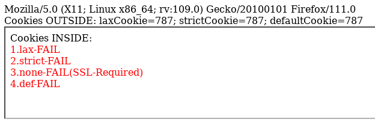
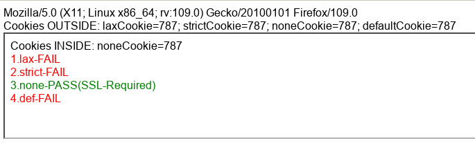

= Test-Case

Example to show https://bugzilla.mozilla.org/show_bug.cgi?id=1741489[the FireFox bug] with some details

Start with `node ./bin/www` and access http://localhost:5000 with different Browsers.

Some Examples of working and non-working Browsers:

image::chrome-example.png[Chrome 109]

